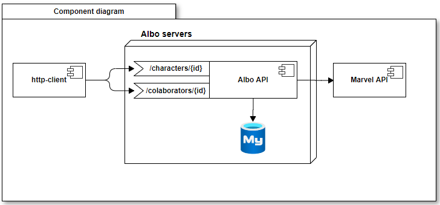
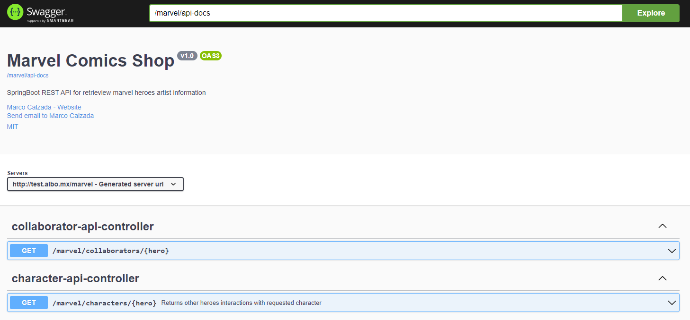

# 🦸‍♂️Marvel Comic Shop

## 📌 Introducción

Con el paso de los años la biblioteca de comics, necesita tener actualizado todo el listado de escritores, editores y coloristas de cómics que han estado
involucrados en las historias de los siguientes integrantes de los Vengadores (Iron Man, Captain America). Así como todos los demás héroes que a través de
cada cómic han interactuado con cada uno de ellos. Esto hay que actualizarlo diario, ya que hay que pagarles regalías respectivas a los escritores,
editores y coloristas.

Esta API también contiene documentación mediante [OpenAPI](https://www.openapis.org) que se puede visualizar en `http://{hostname}/marvel/swagger-ui`

## 🗞 Inicio Rápido

El proyecto cuenta con dos scripts que permiten la ejecución rápida del mismo:

- [x] Para compilar y construir el proyecto ejecutar: `./assemble.sh`
- [x] Para ejecutar la API en el puerto 80: `./assemble.sh`

### Ejecución sobre el código fuente

Al contar con el código fuente, se pueden ejecutar los siguientes comandos, esto permitirá iniciar los recursos de base de datos y también desplegar la
aplicación

- [x] Start database service with: `docker-compose up -d`
- [x] Build and execute application: `mvn spring-boot:run`

## 📋 Requerimientos de sistema

- Los scripts (assemble.sh y avengers.sh) únicamente se pueden ejecutar sobre S.O. basados en unix.
- Versión 1.8 de [Java](https://docs.oracle.com/javase/8/docs/technotes/guides/install/install_overview.html).
- Se requiere contar con [Docker](https://www.docker.com)
- Se requiere contar con [Maven](https://maven.apache.org)

## 🚪 Definición de endpoints REST

Para conocer la documentación del API, puedes visitar el recurso del sitio `/marvel/api-docs` y `/marvel/`. Mediante documentación generada por OpenAPI, se
puede conocer la definición de los endpoints y modelos que componen la API.

### Ruta de contexto

Por defecto, la ruta de contexto para la API es `/marvel/`

### Endpoints disponibles

Los endpoints disponibles en la aplicación son:

🟢 Characters endpoint ( `/characters` ):

Obtiene una lista de los otros héroes con los cuales el personaje solicitado ha interactuado en cada uno de los cómics.

> `curl -X 'GET' 'http://test.albo.mx/marvel/marvel/characters/Iron%20Man' -H 'accept: application/json'`

🟢 Collaborators endpoint ( `/collaborators` )

Obtiene una lista de los editores, escritores y coloristas que han estado involucrados en los comics del personaje solicitado.

> `curl -X 'GET' 'http://test.albo.mx/marvel/marvel/collaborators/Iron%20Man' -H 'accept: application/json'`

## 🧪 Testing

El proyecto contiene una serie de tests unitarios que permiten validar la funcionalidad de la aplicación. Para poder realizar la ejecución de los mismos,
se deberá ejecutar `mvn test` sobre la raíz del proyecto.

- [x] Ejecución de tests unitarios: `mvn test`

Adicional a las pruebas unitarias, puede ser funcional para las pruebas de integración el uso de [postman](https://www.postman.com) con las definiciones de
API que se encuentran en [esta carpeta](/doc/postman)